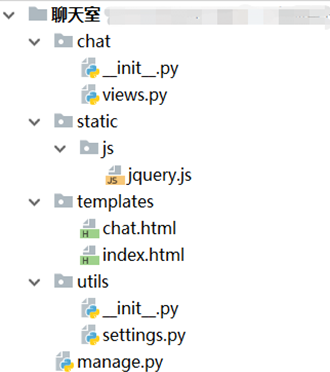

# tornado使用操作指南--websocket

>Auth: 王海飞
>
>Data：2019-02-18
>
>Email：779598160@qq.com
>
>github：https://github.com/coco369/knowledge 

### 1. WebSocket

Tornado中也支持WebSocket，模块名为tornado.websocket,其中提供了一个WebSocketHandler类进行处理通信。

<b style="color:red;"> WebSocketHandler类</b>相关方法如下:

<b> 1) open() </b>:表示当一个WebSocket连接建立后，会主动调用。

<b> 2) on_message(message) </b>: 表示接收客户端发送过来的message参数。

<b> 3) on_close() </b>: 表示关闭WebSocket连接后被调用。 

<b> 4) write_message(message，binary=False) </b>: 表示向客户端发送消息message，binary参数为True表示发送任何字节码，binary为False表示咦utf8编码发送message。

<b> 5) close() </b>: 关闭WebSocket连接。

<b> 6) check_origin(origin) </b>: 表示判断源origin，如果源origin符合条件则返回True，如果不符合则返回403。重写该方法用以解决跨域请求。即返回True即可。

### 2. 多人在线聊天室（利用WebSocket）

Tornado聊天室应用项目结构图中各模块的用法:

	views.py文件: 编写业务逻辑的py文件。
	static文件夹: 用于存放静态文件的文件夹。
	templates文件夹: 用于存放模板的文件夹。
	settings.py文件: 用于定义配置信息的py文件。
	manage.py文件: 用于启动项目的py文件。

#### 2.1 启动manage.py文件

manage.py文件作为启动项目文件，因此py文件主要实现配置路由、静态资源、监听端口等功能

	import tornado.web
	import tornado.httpserver
	import tornado.ioloop
	
	from tornado.options import define, options
	
	from chat.views import IndexHandler, LoginHandler, ChatHandler
	from utils.settings import TEMPLATE_PATH, STATIC_PATH
	
	define("port", default=8180, help="run on the given port", type=int)
	
	
	def make_app():
	    return tornado.web.Application(handlers=[
	        (r'/', IndexHandler),
	        (r'/login', LoginHandler),
	        (r'/chat', ChatHandler),
	    ],
	        template_path=TEMPLATE_PATH,
	        static_path=STATIC_PATH,
	        debug=True,
	        cookie_secret='cqVJzSSjQgWzKtpHMd4NaSeEa6yTy0qRicyeUDIMSjo='
	    )
	
	
	# 程序运行入口
	if __name__ == '__main__':
	    app=make_app()
	    http_server=tornado.httpserver.HTTPServer(app)
	    http_server.listen(options.port)
	    tornado.ioloop.IOLoop.current().start()

#### 2.2 定义项目的配置settings.py文件

	import os
	
	# 获取项目的绝对路径
	BASE_DIR = os.path.dirname(os.path.dirname(os.path.abspath(__file__)))
	
	# 静态文件
	TEMPLATE_PATH = os.path.join(BASE_DIR, 'templates')
	STATIC_PATH = os.path.join(BASE_DIR, 'static')

#### 2.3 定义views.py文件

	import tornado.web
	import tornado.websocket
	
	
	class IndexHandler(tornado.web.RequestHandler):
	    # 定义首页视图处理类，提示用户登录
	    def get(self):
	        self.render('index.html')
	
	
	class LoginHandler(tornado.web.RequestHandler):
	    # 定义登录视图处理类
	    def get(self):
	        # 获取用户登录的昵称
	        nickname=self.get_argument('nickname')
	        # 将用户登录的昵称保存在cookie中，安全cookie
	        self.set_secure_cookie('nickname',nickname)
	        self.render('chat.html',nickname=nickname)
	
	
	class ChatHandler(tornado.websocket.WebSocketHandler):
	    # 定义接收/发送聊天消息的视图处理类，继承自websocket的WebSocketHandler
	
	    # 定义一个集合，用来保存在线的所有用户
	    online_users = set()
	    # 从客户端获取cookie信息
	
	    # 重写open方法，当有新的聊天用户进入的时候自动触发该函数
	    def open(self):
	        # 当有新的用户上线，将该用户加入集合中
	        self.online_users.add(self)
	        # 将新用户加入的信息发送给所有的在线用户
	        for user in self.online_users:
	            user.write_message('【%s】进入了聊天室' % self.request.remote_ip)
	
	    # 重写on_message方法，当聊天消息有更新时自动触发的函数
	    def on_message(self, message):
	        # 将在线用户发送的消息通过服务器转发给所有的在线用户
	        for user in self.online_users:
	            user.write_message('%s:%s' % (self.request.remote_ip, message))
	
	    # 重写on_close方法，当有用户离开时自动触发的函数
	    def on_close(self):
	        # 先将用户从列表中移除
	        self.online_users.remove(self)
	        # 将该用户离开的消息发送给所有在线的用户
	        for user in self.online_users:
	            user.write_message('【%s】离开了聊天室~' % self.request.remote_ip)
	
	    # 重写check_origin方法, 解决WebSocket的跨域请求
	    def check_origin(self, origin):
	        return True

#### 2.4 定义index.html页面和chat.html页面

index.html页面代码:

	<!DOCTYPE html>
	<html lang="en">
	<head>
	    <meta charset="UTF-8">
	    <title>聊天室登录首页</title>
	    
	</head>
	<body>
	

	    

	        

	            聊天室个人登录
	        

	        

	            <form method="get" action="/login" style="width:80%">
	                
昵称:<input type="text" placeholder="请输入昵称" name="nickname">

	                <button type="submit">登录</button>
	            </form>
	        

	    

	

	</body>
	</html>

chat.html页面代码

	<!DOCTYPE html>
	<html lang="en">
	<head>
	    <meta charset="UTF-8">
	    <title>Tornado聊天室</title>
	    
	</head>
	<body>
	

	    

	        聊天室
	    

	    

	        

	
	        

	        

	            <textarea id="send_content"> </textarea>
	             
	            <button  id="btn" >发送</button>
	        

	    

	

	
	</body>
	</html>

启动Tornado应用项目, 即运行 'python manage.py'，并开启多浏览器访问http://127.0.0.1:8180/地址，在个人登录页面中输入当前用户的昵称，即可跳转到聊天页面。