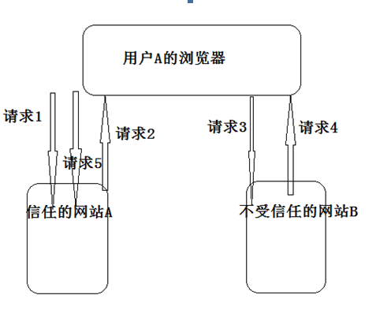

# tornado使用操作指南--跨站请求伪造XSRF

>Auth: 王海飞
>
>Data：2019-03-11
>
>Email：779598160@qq.com
>
>github：https://github.com/coco369/knowledge 

### 1. 前言

XSRF名为跨站请求伪造，也被称为CSRF（Cross-site request forgery）。任何Web应用都有可能面临跨站请求伪造这一安全漏洞，该漏洞允许一个恶意的攻击者在受害者网站上运行未授权的请求。包括以被攻击者的身份发送信息，盗取账号，购买商品等操作。

### 2. 跨站请求攻击原理

简述XSRF攻击的原理图:

 
分析图XSRF攻击原理中各请求:

	请求1: 用户浏览并登陆受信任的网站A。
	请求2: 网站A验证用户登录成功，在浏览器中保存网站A返回的Cookie。
	请求3: 用户在没有退出网站A的情况下，放问不受信任的网站B。
	请求4: 不受信任的网站B要求访问访问网站A的URL，这时浏览器会带上网站A的Cookie发出这个请求（请求5）。因此网站A以为当前访问该URL是用户主动的行为，达到跨站请求攻击的目的。

### 3. 跨站请求攻击防御

跨站请求攻击的防御方法很多，但基本思想都是一致的，那就是每个请求都必须包含一个存储在cookie中的参数值作为令牌。当一个合法的表单被提交时，它将提交表单的信息和已存储在cookie中的令牌值，如果服务端验证该令牌不匹配，则认为请求不合法，不给于响应。通过这种形式达到防御跨站攻击，在Tornado中可以如下示例配置实现防御请求攻击。

XSRF防御:

	import os
	
	import tornado.httpserver
	import tornado.ioloop
	import tornado.options
	import tornado.web
	import tornado.httpclient
	from tornado.options import define, options
	
	define("port", default=8080, help="run on the given port", type=int)
	
	
	class RegisterHandler(tornado.web.RequestHandler):
	    def get(self, *args, **kwargs):
	        self.render('register.html')
	
	    def post(self, *args, **kwargs):
	        username = self.get_argument('username')
	        password = self.get_argument('password')
	        # 忽略验证注册的账号、密码功能和实现账号数据存储在数据库的操作
	        self.write('注册成功')
	
	
	def make_app():
	    return tornado.web.Application(handlers=[
	        (r"/register/", RegisterHandler),
	    ],
	        template_path=os.path.join(os.path.dirname(__file__), "templates"),
	        # 开启xsrf加密
	        xsrf_cookies=True,
	        cookie_secret='cqVJzSSjQgWzKtpHMd4NaSeEa6yTy0qRicyeUDIMSjo=')
	
	
	if __name__ == "__main__":
	    tornado.options.parse_command_line()
	    app = make_app()
	    http_server = tornado.httpserver.HTTPServer(app)
	    http_server.listen(options.port)
	    tornado.ioloop.IOLoop.instance().start()

模板register.html如下所示:

	<!DOCTYPE html>
	<html lang="en">
	<head>
	    <meta charset="UTF-8">
	    <title>注册页面</title>
	</head>
	<body>
	    <form action="" method="post">
	        
	        
账号: <input type="text" name="username">

	        
密码 <input type="text" name="password">

	        
<input type="submit" value="提交">

	    </form>
	</body>
	</html>

以上示例中需要注意如下两点即可:

1）在实例化Appllication对象时，传入xsrf_cookies参数并设置为True。

2）在模板register.html中添加，在渲染模板文件时，该标签会解析为name=‘_xsrf’的隐藏input标签。

<b style="color:red;">执行流程:</b> 当访问http://127.0.0.1:8080/register/地址时，可以从浏览器的cookies中发现自动生成了一个名为_xsrf的cookie。而当在提交表单时，除了提交表单中的账号和密码参数，还会提交名为‘_xsrf’隐藏值，用以防止跨站请求的作用。
