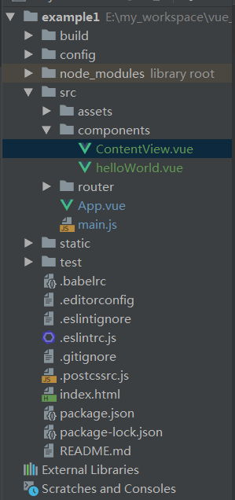

# vue使用操作指南--vue路由配置应用

>Auth: 王海飞
>
>Data：2019-02-22
>
>Email：779598160@qq.com
>
>github：https://github.com/coco369/knowledge 

### 1. 项目结构

在components组件文件夹中自定义组件ContentView.vue文件，该文件用于展示网页的基本内容。

### 2. 模板实现

&nbsp;&nbsp;&nbsp;&nbsp;&nbsp;&nbsp;&nbsp;&nbsp;在App.vue中的<template>标签内定义<router-link>和<router-view>标签。其中<router-link>标签用于定义页面中点击的内容，标签<router-link to="/路由">中属性to表示当用户点击之后将跳转的路由地址。<router-view>标签定义显示组件中定义的内容。

修改App.vue中内容:

	<template>
	  

	    
	
	    <hello></hello>
	    <ul class="nav">
	      <li>
		// 定义点击链接，跳转到路由'/contentview'
	        <router-link to="/contentview">Vue基本使用</router-link>
	      </li>
	    </ul>
		// 点击按钮后，显示组件中定义的内容
	    <router-view></router-view>
	  

	</template>

### 3. 路由解析

&nbsp;&nbsp;&nbsp;&nbsp;&nbsp;&nbsp;&nbsp;&nbsp;在main.js文件中定义解析跳转路由'/contentview'和组件ContentView.vue的对应关系。 路由的定义需要先定义route，再定义routers，最后定义router。

	// 系统原本写法
	// import Vue from 'vue'
	
	// 报错解决: 通过以下方式导入Vue
	import Vue from 'vue/dist/vue.js'
	import App from './App'
	import VueRouter from 'vue-router'
	
	// vue-router使用
	// 1.导入组件
	import ContentView from './components/ContentView.vue'
	
	Vue.config.productionTip = false

	// 2. 明确地安装使用路由功能
	Vue.use(VueRouter)
	
	// 3. 定义路由，当访问路由'/contentview'地址时，调用主键ContentView
	var routes = [
	  {
	    path: '/contentview',
	    component: ContentView
	  }
	]
	
	// 4. 创建 router 实例
	var router = new VueRouter({
	  routes
	})
	
	new Vue({
	  // 渲染App.vue
	   render: h => h(App),
	  // 5. 创建和挂载根实例
	  router
	}).$mount('#app')

### 4. 定义组件ContentView.vue

在src/components/文件路径下创建组件ContentView.vue文件, ContentView.vue内容如下:

	<template>
	  

	    

	    <h1> Vue基本使用 </h1>
	
	    <!-- 数据渲染 {{}} -->
	    
 英文名: {{ name1 }} 

	 
	    

	  

	</template>
	
	

在template标签中定义解析p标签，p标签中的值在script中进行定义。

