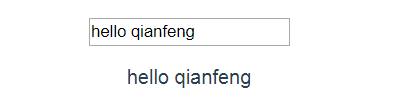

# vue使用操作指南--vue内部指令

>Auth: 王海飞
>
>Data：2019-02-21
>
>Email：779598160@qq.com
>
>github：https://github.com/coco369/knowledge

### 1. 指令

Vue的内部指令: 

1)：指令是带有v-前缀的特殊特性，值限定为绑定表达式，也就是js表达式以及过滤器

2)：指令的作用是当表达式的值发生变化的时候，将这个变化也反应到DOM上。
   比如: 
DDFE
  当show为true的时候，展示DDFE字样，否则不展示

3)：有一些指令的语法有些不一样，在指令与表达式之间插入一个参数，用冒号分隔，如v-bind指令或者

### 2. v-if、v-else指令

v-if、v-else:是vue 的一个内部指令，指令用在我们的html中。v-if和v-else需要配和在一起使用。

v-if指令用于判断是否加载html的DOM，比如我们模拟一个用户登录状态，在用户登录后现实用户名称。

	<template>
	  

	    
你好：CoCo

	    
请登录后操作

	  

	</template>
	
	

在vue的data里定义了isLogin的值，当它为true时，网页就会显示：你好：CoCo，如果为false时，就显示请登录后操作。

### 3. v-show指令

v-show指令: 用于调整css中的display属性。 如果isShow为true，则div属性中display属性为block。如果isShow为false，则div属性中display属性为none。

	<template>
	  

		// v-show指令
	    
你好：CoCo

	  

	</template>
	
	

### 4. v-for指令

v-for指令是循环渲染一组data中的数组，v-for 指令需要以 item in items 形式的特殊语法，items 是源数据数组并且item是数组元素迭代的别名。

	<template>
	  

		<!-- v-for指令 -->
	    <li v-for="item in items">
	      {{item}}
	    </li>
	    
	    <li v-for="(key, value) in objs">
	      {{key}}-{{value}}
	    </li>
	
	    <li v-for="(key, value, index) in objs">
	      {{index}}-{{key}}-{{value}}
	    </li>
	  

	</template>
	
	

<b>注意</b> : 使用v-for指令进行循环获取数据，如objs变量，通过v-for="(key, value, index) in objs"进行取值，key为objs中的value值，value为objs中的key值，index为循环的序号(从1开始)

### 5. v-on 绑定事件监听器

v-on指令监听DOM事件来触发一些javascript代码。

如下: 定义两个点击事件，并触发弹窗
	
	<template>
	  

		// 打印score变量的值
	    {{ score }}
	    <!-- v-on指令 -->

	    
 今天天气如何? 

	    
千锋教育怎么样？

	
	  

	</template>
	
	

如下图效果:

### 7. v-html/v-text

在vue文件中解析输出data中的变量时，使用{{ 变量名 }}的形式。 但这种情况是有弊端的，就是当我们网速很慢或者javascript出错时，会暴露我们的{{ 变量名 }}。Vue给我们提供的v-text,就是解决这个问题的。而v-html可以渲染输出真正的HTML，如h2标签。需要注意的是：在生产环境中动态渲染HTML是非常危险的，因为容易导致XSS攻击。所以只能在可信的内容上使用v-html，永远不要在用户提交和可操作的网页上使用。

    

      {{ message }}= 
      
    

	

总结: v-text只能解析变量内容，而v-html可以解析内容中带有的标签属性。