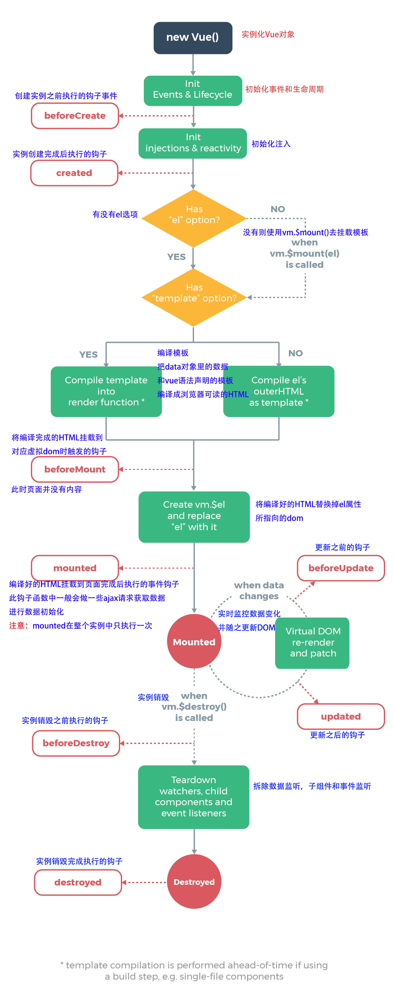

# vue使用操作指南--vue生命周期

>Auth: 王海飞
>
>Data：2019-02-26
>
>Email：779598160@qq.com
>
>github：https://github.com/coco369/knowledge

### 1. 实例生命周期钩子

每个 Vue 实例在被创建时都要经过一系列的初始化过程——例如，需要设置数据监听、编译模板、将实例挂载到 DOM 并在数据变化时更新 DOM 等。同时在这个过程中也会运行一些叫做生命周期钩子的函数，这给了用户在不同阶段添加自己的代码的机会。

比如 created 钩子可以用来在一个实例被创建之后执行代码：

	export default {
	  data: {
	    a: 1
	  },
	  created: function () {
	    // `this` 指向当前vue实例对象
	    console.log('a is: ' + this.a)
	  }
	}
	// => "a is: 1"

也有一些其它的钩子，在实例生命周期的不同阶段被调用，如 mounted、updated 和 destroyed。<b style="color:red;">生命周期钩子的 this 上下文指向调用它的 Vue 实例</b>。

### 2. 生命周期图示

下图展示了实例的生命周期。你不需要立马弄明白所有的东西，不过随着你的不断学习和使用，它的参考价值会越来越高。

定义加法和销毁的点击事件:

    <!--生命周期-->
    
加法

    {{ score }}
    
销毁

定义生命周期:

	export default {
	  // 引用外部数据
	  data () {
	    return outData
	  },
	  methods: {
	    add: function () {
	      this.score++
	    }
	  },
	  beforeCreate: function () {
	    console.log('1-beforeCreate 初始化之后')
	  },
	  created: function () {
	    console.log('2-created 创建完成')
	  },
	  beforeMount: function () {
	    console.log('3-beforeMount 挂载之前')
	  },
	  mounted: function () {
	    console.log('4-mounted 被挂载之后')
	  },
	  beforeUpdate: function () {
	    console.log('5-beforeUpdate 数据更新前')
	  },
	  updated: function () {
	    console.log('6-updated 被更新后')
	  },
	  activated: function () {
	    console.log('7-activated')
	  },
	  deactivated: function () {
	    console.log('8-deactivated')
	  },
	  beforeDestroy: function () {
	    console.log('9-beforeDestroy 销毁之前')
	  },
	  destroyed: function () {
	    console.log('10-destroyed 销毁之后')
	  }
	}
	</script>

分析:

1） 刷新页面时，在浏览器的控制台中会打印:

	1-beforeCreate 初始化之后
	2-created 创建完成
	3-beforeMount 挂载之前
	4-mounted 被挂载之后

2）在点击加法按钮时，控制台会打印如下输出:

	5-beforeUpdate 数据更新前
	6-updated 被更新后

3）在点击销毁按钮时，控制台会打印如下输出:

	9-beforeDestroy 销毁之前
	10-destroyed 销毁之后

