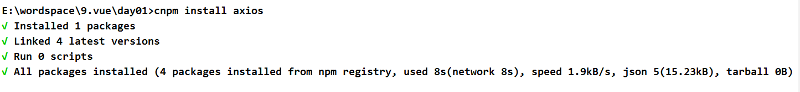
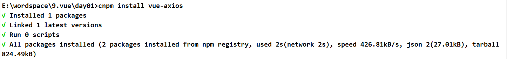

# vue使用操作指南--vue的axios的使用

>Auth: 王海飞
>
>Data：2019-03-28
>
>Email：779598160@qq.com
>
>github：https://github.com/coco369/knowledge

### 前言

官方维护了一个 request 项目是 vue-resource ，后来推荐使用社区的 axios 来作为 request 工具。

两者之间的区别：

1. axios支持服务端（Node中自带的 request 包并不支持promise，通常需要使用bluebird来进行promise化），resource不支持服务端。

2. axios 功能更加丰富，支持 Intercept 功能。

### 1. 安装axios

安装命令:

	npm install --save axios vue-axios

### 2. axios的配置

在入口main.js中导入axios 并将axios写入vue的原型，这样就能更简单的使用

	import axios from 'axios'
	import VueAxios from 'vue-axios'
	
	Vue.use(VueAxios, axios)

	
如果需配置全局axios访问的路由前缀，可以配置如下内容:

	import axios from 'axios'
	const ajax = axios.create({
	  baseURL: 'http://127.0.0.1:8000'
	})
	Vue.config.productionTip = false
	Vue.prototype.axios = ajax

### 3. axios.get()方法 

#### 3.1 无参情况

axios封装了get方法，传入请求地址和请求参数即可。 then中返回的是正常情况下的数据，而catch中返回的是错误信息。请求格式为: <b>this.axios.get(url).then(res => {}).catch(err => {})</b>

	
	
#### 3.2 有参情况

axios封装了get方法，get方法可以接收请求参数，请求参数定义在格式为: <b>this.axios.get(url, { params }).then(res => {}).catch(err => {})</b>

	

### 4. axios.post()方法

axios封装了post方法，post方法可以接收请求参数，请求参数定义在格式为: <b>this.axios.post(url, params).then(res => {}).catch(err => {})</b>

	export default {
	
	  mounted: function () {
	    var url = 'http://127.0.0.1:8000/api/article/article/'
	    var params = {
	      title: '1213',
	      desc: '321'
	    }
	    this.axios.post(url, params)
	      .then(res => {
	        console.log(res.data)
	      })
	      .catch(err => {
	        alert(err)
	      })
	  }
	}
	</script>

### 5. axios经典写法

axios的经典写法，post请求格式为: <b>this.axios({method: 'post',url: url，data: params}).then(res => {}).catch(err => {})</b>

	

