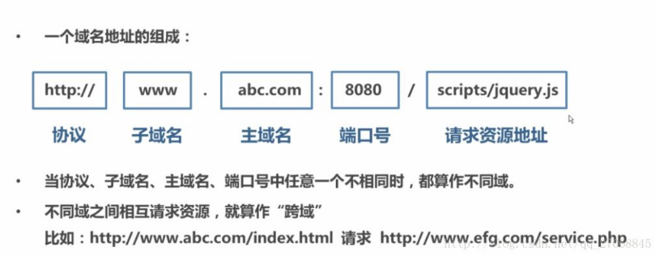

# vue使用操作指南--vue跨域

>Auth: 王海飞
>
>Data：2019-03-28
>
>Email：779598160@qq.com
>
>github：https://github.com/coco369/knowledge

### 前言--跨域请求

前端对Cross-Origin Resource Sharing 问题(CORS，中文又称'跨域')应该很熟悉了。众所周知出于安全的考虑，浏览器有个同源策略，对于不同源的站点之间的相互请求会做限制（跨域限制是浏览器行为，不是服务器行为。）。

跨域一句话的理解就是：服务端和请求端的地址不一样。

### 1. 同源策略

	同源指的是域名（或IP），协议，端口都相同。
	不同源的客户端脚本(javascript、ActionScript)在没明确授权的情况下，不能读写对方的资源。

### 2. 同源的判定
以http://www.example.com/dir/page.html为例，以下表格指出了不同形式的链接是否与其同源：（原因里未申明不同的属性即说明其与例子里的原链接对应的属性相同）

链接  结果 原因

http:// www.example.com /dir/page2.html	是	同协议同域名同端口

http:// www.example.com /dir2/other.html	是	同协议同域名同端口

http://www.example.com: 81/dir/other.html	否	端口不同

https://www.example.com/dir/other.html	否	协议不同端口不同

http:// en.example.com/dir/other.html	否	域名不同

http:// example.com/dir/other.html	否	域名不同（要求精确匹配）

http:// v2.www.example.com/dir/other.html	否	域名不同（要求精确匹配）

### 3. 服务器运行跨域配置

#### 3.1 安装 django-cors-headers	

	pip install django-cors-headers	

#### 3.2 添加到已安装的应用程序中

	INSTALLED_APPS  =（
	     ... 
	    ' corsheaders '，
	     ... 
	）

#### 3.3 添加中间件类来收听响应

	MIDDLEWARE  = [
	    ... 
		# 跨域请求中间件
	    'corsheaders.middleware.CorsMiddleware'，
	    ' django.middleware.common.CommonMiddleware'，
	     ... 
	]

#### 3.4 跨域配置

	# 跨域允许的请求方式，可以使用默认值，默认的请求方式为:
	# from corsheaders.defaults import default_methods
	CORS_ALLOW_METHODS = (
	    'GET',
	    'POST',
	    'PUT',
	    'PATCH',
	    'DELETE',
	    'OPTIONS'
	)
	
	# 允许跨域的请求头，可以使用默认值，默认的请求头为:
	# from corsheaders.defaults import default_headers
	# CORS_ALLOW_HEADERS = default_headers

	CORS_ALLOW_HEADERS = (
	    'XMLHttpRequest',
	    'X_FILENAME',
	    'accept-encoding',
	    'authorization',
	    'content-type',
	    'dnt',
	    'origin',
	    'user-agent',
	    'x-csrftoken',
	    'x-requested-with',
	    'Pragma',
	)
	
	# 跨域请求时，是否运行携带cookie，默认为False
	CORS_ALLOW_CREDENTIALS = True
	# 允许所有主机执行跨站点请求，默认为False
	# 如果没设置该参数，则必须设置白名单，运行部分白名单的主机才能执行跨站点请求
	CORS_ORIGIN_ALLOW_ALL = True