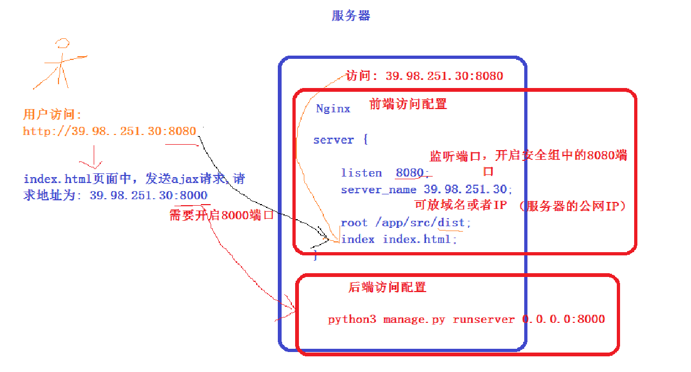
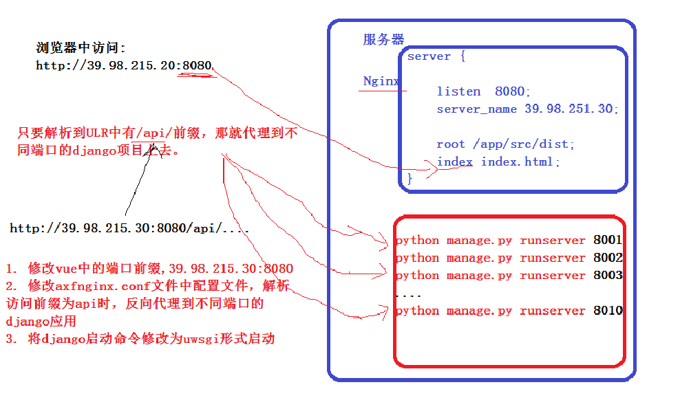

# 使用centos部署django项目--前后分离部署

>Auth: 王海飞
>
>Data：2019-04-03
>
>Email：779598160@qq.com
>
>github：https://github.com/coco369/knowledge


### 1. vue打包

vue打包命令:

	npm run build

<b>注意</b>: 这个时候直接打开dist/下的index.html,会发现文件可以打开，但是所有的js，css，img等路径有问题是指向根目录的。
此时需要修改config/index.js里的assetsPublicPath的字段，初始项目是/他是指向项目根目录，这时改为./即可。

	./ 当前目录
	
	../ 父级目录
	
	/ 根目录


### 2. 修改配置


	build: {
	    // Template for index.html
	    index: path.resolve(__dirname, '../dist/index.html'),
	
	    // Paths
	    assetsRoot: path.resolve(__dirname, '../dist'),
	    assetsSubDirectory: 'static',
	    assetsPublicPath: './',
	
	    /**
	     * Source Maps
	     */
	
	    productionSourceMap: true,
	    // https://webpack.js.org/configuration/devtool/#production
	    devtool: '#source-map',
	
	    // Gzip off by default as many popular static hosts such as
	    // Surge or Netlify already gzip all static assets for you.
	    // Before setting to `true`, make sure to:
	    // npm install --save-dev compression-webpack-plugin
	    productionGzip: false,
	    productionGzipExtensions: ['js', 'css'],
	
	    // Run the build command with an extra argument to
	    // View the bundle analyzer report after build finishes:
	    // `npm run build --report`
	    // Set to `true` or `false` to always turn it on or off
	    bundleAnalyzerReport: process.env.npm_config_report
	  }

<b>重点</b>: 将assetsPublicPath参数修改为'./'


**注意**：可能按照以上的方式修改以后会引起selementui的icon图标错乱。解决办法如下：

【问题1】npm run dev的时候elementui的图标能够看见，但是将项目打包后扔到tomcat里面跟后端服务一起部署的时候，图标丢失，打开浏览器控制台，发现报404错误。可以看到找elementui的图标的样式的时候是到

http://localhost:8080/static/css/static/fonts/element-icons.535877f.woff 这个路径下找字体图标文件，可以发现多了个static/css

而fonts文件夹是跟css文件夹平行的，应该找http://localhost:8080/static/fonts/element-icons.535877f.woff 这个路径才能找到。排查思路是看前端打包配置里面搜索fonts文件夹的配置。最后在webpack.base.conf.js里面找到配置如下:

修改前:
```
{
        test: /\.(woff2?|eot|ttf|otf)(\?.*)?$/,
        loader: 'url-loader',
        options: {
          limit: 10000,
          name: utils.assetsPath('fonts/[name].[hash:7].[ext]')
        }
      }
```
修改后: 
```
{
        test: /\.(woff2?|eot|ttf|otf)(\?.*)?$/,
        loader: 'url-loader',
        options: {
          limit: 10000,
          name: '[name].[hash:7].[ext]',
          publicPath: '../fonts/',
          outputPath: utils.assetsPath('fonts/')
        }
      }
```


### 3. nginx.conf配置文件

root参数表示前端dist文件路径

index表示访问首页地址页面

proxy_pass 表示反向代理地址

#### 如下配置反向代理到8000端口的配置:

	server{
	    listen    8080;
	    server_name   39.100.40.34;
	
	    root /home/src/dist;
	    index index.html;
	
	    location /api {
	        proxy_pass http://39.100.40.34:8000;
	    }
	}



#### 反向代理多端口配置，如下配置反向代理8001、8002、8003端口：

	upstream backend {
	    server 127.0.0.1:8001;
	    server 127.0.0.1:8002;
	    server 127.0.0.1:8003;
	}


​	
​	server {
​	
​	    listen  8080;
​	    server_name 39.98.251.30;
​	
	    root /app/src/dist;
	    index index.html;
	
	    location /api/ {
	        proxy_pass http://backend;
	    }
	}

<b>注意</b>: 当在浏览器中访问http://39.98.251.30:8080地址时，浏览器中将访问/app/src/dist/index.html页面，并且将页面中所有访问以/api/开头的路由地址，反向解析到backend中定义的地址与端口上。

<b>特别注意</b>: server中定义的监听端口为8080，因此在vue中配置访问的axios的请求前缀baseURL也将定义为http://39.98.251.30:8080。

