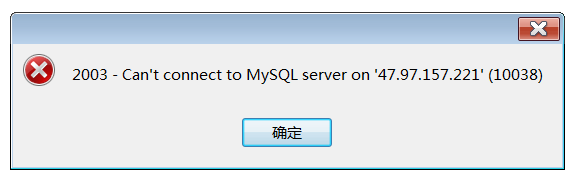
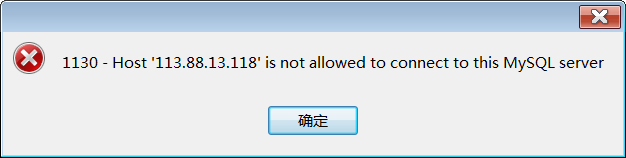

# 使用ubuntu部署Flask项目（博客blog）

>Auth: 王海飞
>
>Data：2019-04-25
>
>Email：779598160@qq.com
>
>github：https://github.com/coco369/knowledge

### 前言

&nbsp;&nbsp;&nbsp;&nbsp;&nbsp;&nbsp;&nbsp;Ubuntu（友帮拓、优般图、乌班图）是一个以桌面应用为主的开源GNU/Linux操作系统，Ubuntu 是基于Debian GNU/Linux，支持x86、amd64（即x64）和ppc架构，由全球化的专业开发团队（Canonical Ltd）打造的

<b>Ubuntu</b>

&nbsp;&nbsp;&nbsp;&nbsp;&nbsp;&nbsp;&nbsp;Ubuntu近些年的粉丝越来越多，Ubuntu有着漂亮的用户界面，完善的包管理系统，强大的软件源支持，丰富的技术社区，Ubuntu还对大多数硬件有着良好的兼容性，包括的图形显卡等等。这一切让Ubuntu越来越向大众化方向发展。但别忘了：你所需要的只是一个简约、稳定、易用的服务器系统而已！
Ubuntu的图形界面固然漂亮，但这也决定了它较佳的应用领域是桌面操作系统而非服务器操作系统。如何你希望在学习Linux的过程中有个沉浸式的环境，那么Ubuntu的确不错。

<b>CentOS</b>

&nbsp;&nbsp;&nbsp;&nbsp;&nbsp;&nbsp;&nbsp;你会发现非常多的商业公司部署在生产环境上的服务器都是使用的CentOS系统，CentOS是从RHEL源代码编译的社区重新发布版。CentOS简约，命令行下的人性化做得比较好，稳定，有着强大的英文文档与开发社区的支持。与Redhat有着相同的渊源。虽然不单独提供商业支持，但往往可以从Redhat中找到一丝线索。相对debian来说，CentOS略显体积大一点。是一个非常成熟的Linux发行版。

更新ubuntu的源: sudo apt-get update

#### 1. 安装数据库

1)安装数据库mysql:

	sudo apt install mysql-server mysql-client

注意: 如果安装过程中没有提示输入账号密码，则表示默认root账号的密码为空。因此需要手动的初始化密码。

初始化密码为:
	
	> use mysql；

	> update mysql.user set authentication_string=password('密码') where user='root'and Host = 'localhost';

	> update user set plugin="mysql_native_password"; #如果没这一行可能也会报一个错误，因此需要运行这一行
	 
	> flush privileges; #更新所有操作权限

	> quit;

2)修改远程访问

	# 修改配置参数
	cd /etc/mysql/mysql.conf.d
	修改mysqld.conf 将bind_address注释

	# 先使用数据库
	use mysql;

	# 创建root账号
	create user 'root'@'%' identified by 'password';

	# 给用户最大权限
	grant all privileges on *.* to 'root'@'%' identified by 'password';
	
	# 刷新权限表
 	flush privileges;

3)重启mysql

	service mysql restart

分析，如果使用navicate等工具无法连接数据库，且出现以下所示截图中的错误内容，则需从以下两个点进行分析:

	1. 阿里云服务器的安全组中3306端口是否开启
	2. 是否给root账号开通能被外网访问的权限

#### 2. 安装Python3

&nbsp;&nbsp;&nbsp;&nbsp;&nbsp;&nbsp;&nbsp;由于Ubuntu18.04版本中已默认安装python3.6和python2.7。因此Python3可以不用用户自己安装。如需要安装可按照以下命令执行:

首先安装依赖包

安装Python3.6所需要的依赖包：

	yum -y groupinstall "Development tools"
	
	yum -y install zlib-devel bzip2-devel openssl-devel ncurses-devel sqlite-devel readline-devel tk-devel gdbm-devel db4-devel libpcap-devel xz-devel

安装Python3.7还需额外安装依赖包：

	yum install libffi-devel -y

然后根据自己需求下载不同版本的Python3，我下载的是Python3.6.2

	wget https://www.python.org/ftp/python/3.6.2/Python-3.6.2.tar.xz

	然后解压压缩包，进入该目录，安装Python3

	tar -xvJf  Python-3.6.2.tar.xz
	cd Python-3.6.2
	./configure --prefix=/usr/local/python3
	make && make install

最后创建软链接

	ln -s /usr/local/python3/bin/python3 /usr/bin/python3
	
	ln -s /usr/local/python3/bin/pip3 /usr/bin/pip3

#### 3. 创建虚拟环境

由于Ubuntu下有多个Python版本，因此虚拟环境将采用virtualenv进行创建、或者python3的venv模块

1）使用virtualenv进行虚拟环境的创建
	
	# 安装pip3
	apt install python3-pip

	# 创建python3版本对应的virtualenv
	pip3 install virtualenv

	# 创建虚拟环境blogenv
	virtualenv --no-site-packages blognev

2）使用python3 venv模块进行虚拟环境的创建
	
	# 安装venv模块
	aptinstall python3-venv
	
	# 创建虚拟环境
	python3 -m venv blognenv2

#### 3. 使用nginx+uwsgi配置django项目

1. 安装nginx

		sudo apt install nginx
	
2. 查看nginx的状态

		systemctl status nginx 查看nginx的状态
		systemctl start/stop/enable/disable nginx 启动/关闭/设置开机启动/禁止开机启动
		
		或者是如下命令：

		service nginx status/stop/restart/start

3. 安装uwsgi
	
		pip3 install uwsgi

4. nginx的配置文件中加载自定义的nginx的配置文件

		vim /etc/nginx/nginx.conf
		在server中加入以下配置：
		include /home/app/conf/*.conf;

5. 配置自定义的nginx配置文件

	server {
	    listen       80;
	    server_name 47.92.73.20 localhost;
	
	    access_log /home/app/logs/access.log;
	    error_log /home/app/logs/error.log;
	
	    location / {
	        include uwsgi_params;
	        uwsgi_pass 127.0.0.1:8890;
		
	        uwsgi_param UWSGI_CHDIR /home/app/src/s_aj;
	        uwsgi_param UWSGI_SCRIPT manage:app;   # 启动flask的文件:Flask的实例
	    }
	}

6.配置uwsgi，名称为uwsgi.ini

	[uwsgi]
	master=true
	socket=127.0.0.1:8890
	chdir=/home/src/day06
	pythonpath=/usr/local/python3/bin/python3
	pythonhome=/home/env/sjenv
	callable=app;  # 回调的flask实例
	logto = /home/logs/uwsgi.log

正式线上启动方式： uwsgi --ini uwsgi.ini

<b>注意: 如果服务器中需要使用git版本控制，则使用apt install git进行安装即可</b>
